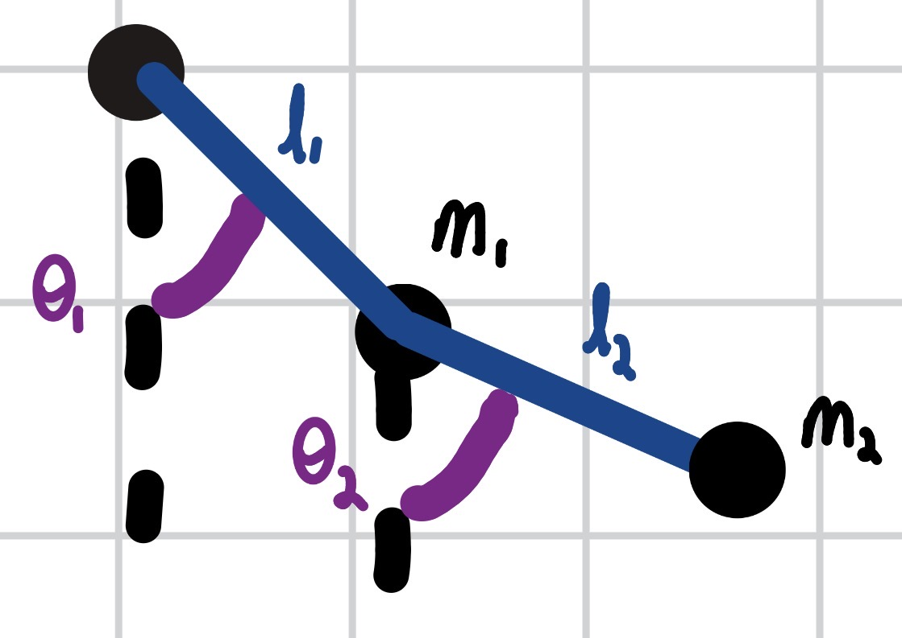
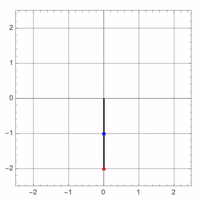
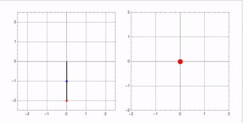
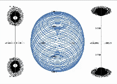
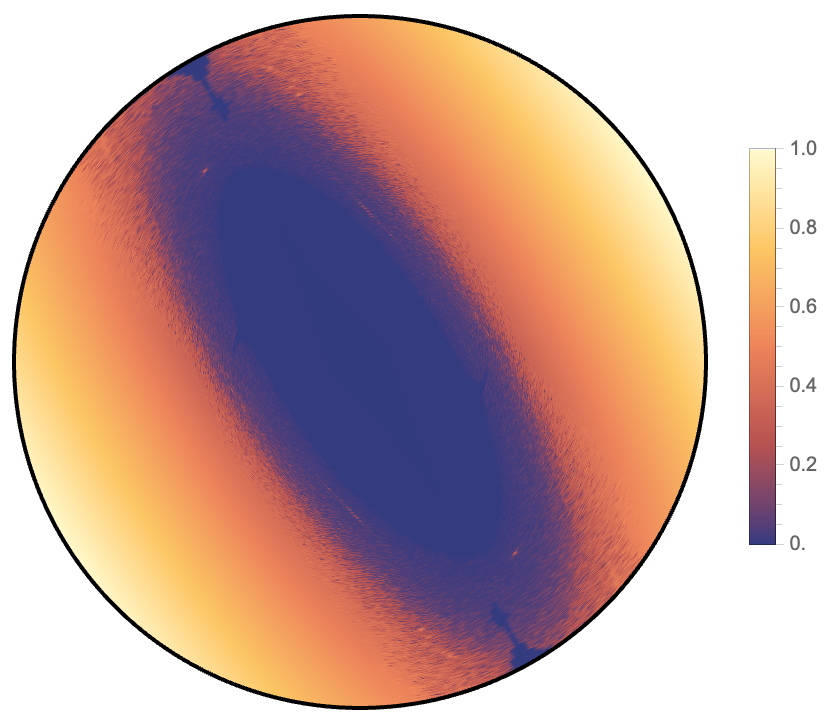
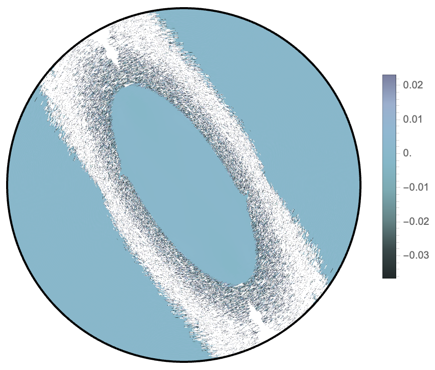

# Double Pendulum: Dynamics, Phase Space, and Chaos
A Mathematica study of the double pendulum from solving the equations and showing the motion, to animating the behavior of the phase space and creating a chaos map.
<!-- Hero GIF: animated double pendulum -->
<p align="center">
  
</p>

## Table of Contents
- [Overview](#overview)
- [Physics Background](#physics-background)
- [Repository Structure](#repository-structure)
- [Notebooks](#notebooks)
  - [1. Main Notebook — Equations of Motion, Animation, and Phase Diagram](#1-main-notebook--equations-of-motion-animation-and-phase-diagram)
  - [2. 4D Phase Space Evolution](#2-4d-phase-space-evolution)
  - [3. Poincaré Sections](#3-poincaré-sections)
  - [4. Chaos Map](#4-chaos-map)
- [Why the Project Is Split Into Multiple Files](#why-the-project-is-split-into-multiple-files)
- [Requirements](#requirements)
- [How to Run](#how-to-run)
- [Results](#results)
- [Future Work](#future-work)
- [License](#license)
- ---
 
## Overview
 
The double pendulum is one of the simplest mechanical systems that exhibits chaotic behavior. Two rigid pendulums attached end to end produce motion that is fully deterministic yet extremely sensitive to initial conditions.
 
This project:
 
2. **Solves** the coupled nonlinear ODEs numerically and **animates** the physical motion alongside its phase diagram.
3. **Sweeps** across initial conditions with increasing angular momentum to construct a **phase diagram that evolves in time**.
4. **Builds Poincaré sections** from the sweep to illustrate stable/chaotic regions.
5. **Generates a chaos map** from 180,000 initial conditions to show which regions lead to chaotic motion.
---
 
## Physics Background
 
The system consists of two point masses, $m_1$ and $m_2$, attached to massless rigid rods of lengths $l_1$ and $l_2$. The generalized coordinates are the angles $\theta_1$ and $\theta_2$ measured from the vertical.
 
<!-- Diagram of the double pendulum setup -->

| Double Pendulum Diagram | Animated Motion| 
|:---:|:---:|
|   |  | 

### Lagrangian
 
With kinetic energy $T$ and potential energy $V$, the Lagrangian is $\mathcal{L} = T - V$:
 
```math
T = \frac{1}{2}(m_1 + m_2)\, l_1^2 \dot{\theta}_1^2
  + \frac{1}{2} m_2\, l_2^2 \dot{\theta}_2^2
  + m_2\, l_1 l_2\, \dot{\theta}_1 \dot{\theta}_2 \cos(\theta_1 - \theta_2)
```

$$
V = -(m_1 + m_2)\ g\ l_1 \cos\theta_1 - m_2\ g\ l_2 \cos\theta_2
$$
 
### Euler–Lagrange Equations
 
Applying
 
$$
\frac{d}{dt}\left(\frac{\partial \mathcal{L}}{\partial \dot{\theta}_i}\right) - \frac{\partial \mathcal{L}}{\partial \theta_i} = 0, \qquad i = 1, 2
$$
 
yields two coupled, second‑order, nonlinear ODEs for $\theta_1(t)$ and $\theta_2(t)$. These are solved numerically in the various notebooks. The derivations where done by hand and are left as an exercise for the reader.
 
### Plotting Solutions
 
The state of the system is fully described by four variables, $(\theta_1, \theta_2, \dot{\theta}_1, \dot{\theta}_2)$, so the phase space is four‑dimensional. There are countless ways to visualize this space from Poincaré sections to animations of the motion. So the project was split up into multiple notebooks for each kind of plot for organization and to lower the memory overhead needed to run everything.

---
 
## Repository Structure
 
```
.
├── README.md
├── DoublePendulum.nb          # numerical solution, animation, 2D phase diagram
├── Pain.nb                # data of ~5,000 initial conditions for time-evolving 4D phase diagram
├── Pain2.nb            # Data for chaos map of around 180,000 initial conditions 
├── PoincareCurve.nb          # The same initial conditions as in pain but makes poincare sections for each slice
├── OMGPrettyPlot.nb                     # Makes 4D phase plot animation from Pain
├── PoincareSections.nb                     # Makes Poincare sections with 4D phase plot animation from Pain
├── PlottingDaFractal.nb                     # Makes the chaos map from the previous Pain2
└── media/                          # GIFs and images used in this README
```

 
---
 
## Notebooks
 
### 1. Main Notebook — Equations of Motion, Animation, and Phase Diagram
 
**File:** `DoublePendulum.nb`
 
This is the starting point of the project. It:
 
- Algebraically solves for $\theta_1$ and $\theta_2$ from the equations given by solving the associated **Euler–Lagrange** equations.
- Solves the equations numerically with `NDSolve` for a chosen set of initial conditions.
- Produces an **animated plot of the actual motion** of the pendulum.
- Produces the **corresponding phase diagram** for that trajectory.
<!-- GIF: animated pendulum motion -->
<p align="center">
  
</p>

 
---
 
### 2. Animated Phase Space Evolution
 
**File:** `Pain`

To analyze the phase space behavior the notebook solves the differential equation from $t=0$ to $t=100,000,000$ in order to make sure the long term behavior of the system was properly captured for any initial condition. Then to model the dynamics of the phase space the notebook sweeps through a series of monotonically increasing initial momentums, which are constrained such that the initial velocities for $\theta_1$ and $\theta_2$ are equivalent. It allows you to control the the first runs momentum and the final runs momentum and the step size between them to get higher or lower temporal resolution for the animation. It then automatically parallelizes the runs and makes a plot of $\dot \theta_1-\dot \theta_2$ on the x-axis and $\theta_1- \theta_2$ on the y-axis to capture the behavior of the initial condition. Then each plot is indexed and saved as an image to act a frame in the final animation (animation can be seen in the youtube link below).

**📺 Video:** [Animation of Phase Space Behavior](https://www.youtube.com/shorts/DSOCYZtIpC4)

**File:** `OMGPrettyPlot.nb`

This notebook takes each frame generated by the previous notebook and compiles them into an animation. The animating is done in a separate notebook since it takes a while to finish and if it crashed you still have the original plots so you can try again without having to redo everything.
 
---
 
### 3. Poincaré Sections
 
**File:** `PoincareCurve.nb`
 
Using the same boundary conditions, starting momentum, and momentum step size as the previous notebook, this notebook creates the Poincaré sections for the previous plot. Due to the way each point is calculated, the simulations stop giving the needed values for the Poincaré sections when you reach a high enough initial momentum. So the the animation of the Poincaré sections with the phase diagram cuts off sooner than the previous one. This notebook works by recording the values $(\dot \theta_2)$ when $\theta_1 = 0$ and $(\dot \theta_1,\theta_1 )$ when $\theta_2 = 0$. It then constructs the associated Poincaré diagram for each run. By recording the state of each time a trajectory crosses 0, the 4D dynamics are reduced to a 2D map. The stable solutions appear as closed curves or isolated points while the chaotic solutions fill the region. These plots are then indexed and exported as an image. Where the results can be seen below or in the linked video. 

<p align="center">
  
</p>

**📺 Video:** [Poincaré section and phase space animation](https://www.youtube.com/watch?v=h9T18S3YEcA)

**File:** `PoincareSections.nb`

This file takes the indexed phase space plots, and the two associated Poincaré sections and combines them into one plot, with the $\theta_1 = 0$ on the left and $\theta_2 = 0$ on the right. It then takes each of these plots and animates them together to show the evolution of the system. It is once again in a separate notebook since making the animations takes a long time and is sometimes prone to crashing. 
 
---
 
### 4. Chaos Map
 
**File:** `Pain2.nb`
 
This notebook produces the data for the chaos map with about 180,000 data points. For any set of initial conditions it evaluates the differential equations from $t=0$ to $t=300$ and records the values of $\theta 1, \theta_2, \dot \theta_1, \dot \theta_2, \theta_1-\theta_2,$ and $\dot \theta_1 - \dot \theta_2$.

Then by exporting the data into a file sequentially you can partition it such that 

It also calculates the difference between the angles and the difference between the velocities when it takes a measurement. 

All the data is saved to a file that is indexed by the initial momentum. In order to fully explore the phase space while being able to easily parallelize the runs, the momentums were constructed in polar coordinates. Since the mass of both pendulums is fixed, the momentum is entirely dependent on the initial velocity. So by plotting $\dot \theta_1$ on the x-axis and $\dot \theta_2$ on the y-axis you can index any run. Where the radial distance outward is total energy of the system and the the angle, $\phi$, from the positive x-axis tells you both the distribution of the energy between $\theta_1$ and $\theta_2$ and the direction of travel. The preset initial condition sweep starts at 0 and then goes radially outwards along the x-axis till a value of 5, taking about 500 time steps 


For any given run you can  

the momentum space was made in polar coordinates, along with the corresponding index. This was done by letting $\theta_1$ by the x-axis and $\theta_2$ be the y-axis.  

a plot over initial‑condition space that classifies each starting configuration according to how chaotic the resulting motion is.

It reveals the intricate boundary between regular and chaotic regions and highlights the sensitivity to initial conditions that makes the double pendulum a classic example of chaos.
 
<!-- Image: chaos map -->
<p align="center">
  
</p>
**📺 Video:** [Chaos map walkthrough](YOUTUBE_LINK_HERE)
 
---
 
## Why the Project Is Split Into Multiple Files
 
Solving ~180,000 initial conditions and rendering the resulting animations is memory‑intensive. The project is deliberately broken into separate notebooks so that each stage can be **run independently on a laptop without crashing the kernel**. The main notebook is lightweight and can be run on its own; the phase‑space, Poincaré, and chaos‑map notebooks can be run one at a time, and intermediate results can be exported to the `data/` folder and re‑imported rather than recomputed.
 
---
 
## Requirements
 
- **Wolfram Mathematica** (version 14.0.0 or later)
- Sufficient RAM for the large sweeps (recommend at least 16 GB; The project runs comfortably on a standard laptop, however the chaos map does take about a day to run)
---
 
## How to Run
 
1. Clone the repository:
```bash
   git clone https://github.com/YOUR_USERNAME/YOUR_REPO_NAME.git
   cd YOUR_REPO_NAME
```
2. Open `DoublePendulum_Main.nb` in Mathematica and evaluate the notebook (**Evaluation → Evaluate Notebook**) to see the derivation, animation, and phase diagram.
3. To reproduce the large‑scale results, open and evaluate the other notebooks **one at a time**:
   - `PhaseSpace_4D.nb`
   - `Poincare_Sections.nb`
   - `ChaosMap.nb`
4. Adjust the number of initial conditions or the integration time at the top of each notebook if you need to reduce memory usage on your machine.
---
 
## Results
 
<!-- Optional: a gallery of the best images/GIFs, or a short summary of key findings -->
 
| Animation | Phase Diagram+ Poincaré Section| "Eye of Sauron" | Chaos Map |
|:---:|:---:|:---:|:---:|
|  |  |  |  |
 
Key observations:
 
- *(Add your findings here — e.g., which regions of initial‑condition space remain regular, where chaos onsets, notable stable solutions found via the Poincaré sections.)*
---
 
 
## License
MIT License

Copyright (c) 2026 Peter Krosniak

Permission is hereby granted, free of charge, to any person obtaining a copy
of this software and associated documentation files (the "Software"), to deal
in the Software without restriction, including without limitation the rights
to use, copy, modify, merge, publish, distribute, sublicense, and/or sell
copies of the Software, and to permit persons to whom the Software is
furnished to do so, subject to the following conditions:

The above copyright notice and this permission notice shall be included in all
copies or substantial portions of the Software.

THE SOFTWARE IS PROVIDED "AS IS", WITHOUT WARRANTY OF ANY KIND, EXPRESS OR
IMPLIED, INCLUDING BUT NOT LIMITED TO THE WARRANTIES OF MERCHANTABILITY,
FITNESS FOR A PARTICULAR PURPOSE AND NONINFRINGEMENT. IN NO EVENT SHALL THE
AUTHORS OR COPYRIGHT HOLDERS BE LIABLE FOR ANY CLAIM, DAMAGES OR OTHER
LIABILITY, WHETHER IN AN ACTION OF CONTRACT, TORT OR OTHERWISE, ARISING FROM,
OUT OF OR IN CONNECTION WITH THE SOFTWARE OR THE USE OR OTHER DEALINGS IN THE
SOFTWARE.
---
 
## Author
 
**Peter** — *(add contact / links here)*
  
